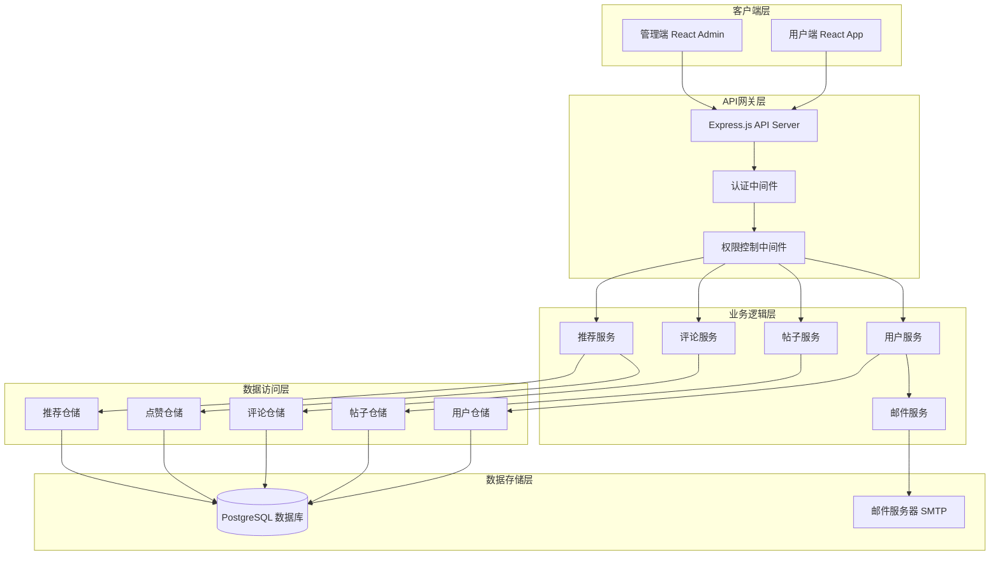
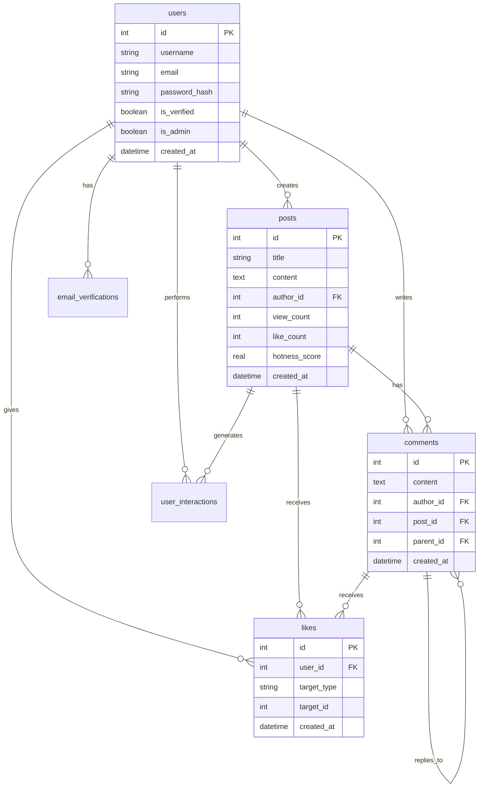

# 论坛系统设计文档

## 概述

本论坛系统采用前后端分离的架构设计，后端使用RESTful API提供服务，前端分为用户端和管理端两个独立应用。系统使用PostgreSQL作为数据存储，集成SMTP邮件服务，并实现基于机器学习的个性化推荐算法。

### 技术栈选择

- **后端框架**: Node.js + Express.js
- **数据库**: PostgreSQL 3 + Sequelize ORM
- **前端框架**: React.js (用户端) + React Admin (管理端)
- **认证方案**: JWT + bcrypt
- **邮件服务**: Nodemailer + SMTP
- **推荐算法**: 协同过滤 + 内容过滤

## 架构设计

### 系统架构图



### 分层架构说明

1. **表现层**: 用户端和管理端前端应用
2. **API层**: Express.js提供RESTful API服务
3. **业务层**: 核心业务逻辑处理
4. **数据层**: 数据访问和持久化

## 组件和接口设计

### 核心组件

#### 1. 认证组件 (AuthService)
```typescript
interface AuthService {
  register(userData: RegisterData): Promise<User>
  login(credentials: LoginData): Promise<AuthResult>
  verifyEmail(token: string): Promise<boolean>
  resetPassword(email: string): Promise<boolean>
  validateToken(token: string): Promise<User>
}
```

#### 2. 帖子管理组件 (PostService)
```typescript
interface PostService {
  createPost(postData: CreatePostData): Promise<Post>
  updatePost(id: string, postData: UpdatePostData): Promise<Post>
  deletePost(id: string): Promise<boolean>
  getPost(id: string): Promise<Post>
  getPosts(filters: PostFilters): Promise<PaginatedPosts>
  getHotPosts(limit: number): Promise<Post[]>
}
```

#### 3. 推荐引擎组件 (RecommendationService)
```typescript
interface RecommendationService {
  getPersonalizedRecommendations(userId: string): Promise<Post[]>
  getHotRecommendations(): Promise<Post[]>
  updateUserPreferences(userId: string, interactions: UserInteraction[]): Promise<void>
  calculatePostHotness(postId: string): Promise<number>
}
```

#### 4. 邮件服务组件 (EmailService)
```typescript
interface EmailService {
  sendVerificationEmail(email: string, token: string): Promise<boolean>
  sendPasswordResetEmail(email: string, token: string): Promise<boolean>
  sendNotificationEmail(email: string, notification: Notification): Promise<boolean>
}
```

### API接口设计

#### 用户认证接口
```
POST /api/auth/register - 用户注册
POST /api/auth/login - 用户登录
POST /api/auth/verify-email - 邮箱验证
POST /api/auth/forgot-password - 忘记密码
POST /api/auth/reset-password - 重置密码
GET /api/auth/profile - 获取用户信息
PUT /api/auth/profile - 更新用户信息
```

#### 帖子管理接口
```
GET /api/posts - 获取帖子列表
GET /api/posts/:id - 获取帖子详情
POST /api/posts - 创建帖子
PUT /api/posts/:id - 更新帖子
DELETE /api/posts/:id - 删除帖子
GET /api/posts/hot - 获取热门帖子
GET /api/posts/recommended - 获取推荐帖子
```

#### 评论系统接口
```
GET /api/posts/:id/comments - 获取帖子评论
POST /api/posts/:id/comments - 创建评论
PUT /api/comments/:id - 更新评论
DELETE /api/comments/:id - 删除评论
POST /api/comments/:id/reply - 回复评论
```

#### 点赞系统接口
```
POST /api/posts/:id/like - 点赞帖子
DELETE /api/posts/:id/like - 取消点赞帖子
POST /api/comments/:id/like - 点赞评论
DELETE /api/comments/:id/like - 取消点赞评论
```

## 数据模型设计

### 数据库表结构

#### 用户表 (users)
```sql
CREATE TABLE users (
  id INTEGER PRIMARY KEY AUTOINCREMENT,
  username VARCHAR(50) UNIQUE NOT NULL,
  email VARCHAR(100) UNIQUE NOT NULL,
  password_hash VARCHAR(255) NOT NULL,
  avatar_url VARCHAR(255),
  is_verified BOOLEAN DEFAULT FALSE,
  is_admin BOOLEAN DEFAULT FALSE,
  is_active BOOLEAN DEFAULT TRUE,
  created_at DATETIME DEFAULT CURRENT_TIMESTAMP,
  updated_at DATETIME DEFAULT CURRENT_TIMESTAMP
);
```

#### 帖子表 (posts)
```sql
CREATE TABLE posts (
  id INTEGER PRIMARY KEY AUTOINCREMENT,
  title VARCHAR(200) NOT NULL,
  content TEXT NOT NULL,
  author_id INTEGER NOT NULL,
  view_count INTEGER DEFAULT 0,
  like_count INTEGER DEFAULT 0,
  comment_count INTEGER DEFAULT 0,
  hotness_score REAL DEFAULT 0,
  is_deleted BOOLEAN DEFAULT FALSE,
  created_at DATETIME DEFAULT CURRENT_TIMESTAMP,
  updated_at DATETIME DEFAULT CURRENT_TIMESTAMP,
  FOREIGN KEY (author_id) REFERENCES users(id)
);
```

#### 评论表 (comments)
```sql
CREATE TABLE comments (
  id INTEGER PRIMARY KEY AUTOINCREMENT,
  content TEXT NOT NULL,
  author_id INTEGER NOT NULL,
  post_id INTEGER NOT NULL,
  parent_id INTEGER,
  like_count INTEGER DEFAULT 0,
  is_deleted BOOLEAN DEFAULT FALSE,
  created_at DATETIME DEFAULT CURRENT_TIMESTAMP,
  updated_at DATETIME DEFAULT CURRENT_TIMESTAMP,
  FOREIGN KEY (author_id) REFERENCES users(id),
  FOREIGN KEY (post_id) REFERENCES posts(id),
  FOREIGN KEY (parent_id) REFERENCES comments(id)
);
```

#### 点赞表 (likes)
```sql
CREATE TABLE likes (
  id INTEGER PRIMARY KEY AUTOINCREMENT,
  user_id INTEGER NOT NULL,
  target_type VARCHAR(20) NOT NULL, -- 'post' or 'comment'
  target_id INTEGER NOT NULL,
  created_at DATETIME DEFAULT CURRENT_TIMESTAMP,
  FOREIGN KEY (user_id) REFERENCES users(id),
  UNIQUE(user_id, target_type, target_id)
);
```

#### 用户行为表 (user_interactions)
```sql
CREATE TABLE user_interactions (
  id INTEGER PRIMARY KEY AUTOINCREMENT,
  user_id INTEGER NOT NULL,
  post_id INTEGER NOT NULL,
  interaction_type VARCHAR(20) NOT NULL, -- 'view', 'like', 'comment'
  interaction_weight REAL DEFAULT 1.0,
  created_at DATETIME DEFAULT CURRENT_TIMESTAMP,
  FOREIGN KEY (user_id) REFERENCES users(id),
  FOREIGN KEY (post_id) REFERENCES posts(id)
);
```

#### 邮件验证表 (email_verifications)
```sql
CREATE TABLE email_verifications (
  id INTEGER PRIMARY KEY AUTOINCREMENT,
  user_id INTEGER NOT NULL,
  token VARCHAR(255) NOT NULL,
  type VARCHAR(20) NOT NULL, -- 'verification' or 'password_reset'
  expires_at DATETIME NOT NULL,
  is_used BOOLEAN DEFAULT FALSE,
  created_at DATETIME DEFAULT CURRENT_TIMESTAMP,
  FOREIGN KEY (user_id) REFERENCES users(id)
);
```

### 数据关系图



## 错误处理设计

### 错误分类和处理策略

#### 1. 客户端错误 (4xx)
- **400 Bad Request**: 请求参数验证失败
- **401 Unauthorized**: 未认证或认证失败
- **403 Forbidden**: 权限不足
- **404 Not Found**: 资源不存在
- **409 Conflict**: 资源冲突（如用户名重复）

#### 2. 服务器错误 (5xx)
- **500 Internal Server Error**: 服务器内部错误
- **502 Bad Gateway**: 邮件服务不可用
- **503 Service Unavailable**: 数据库连接失败

#### 3. 错误响应格式
```typescript
interface ErrorResponse {
  error: {
    code: string;
    message: string;
    details?: any;
    timestamp: string;
  }
}
```

### 错误处理中间件
```typescript
const errorHandler = (err: Error, req: Request, res: Response, next: NextFunction) => {
  const errorResponse: ErrorResponse = {
    error: {
      code: err.name || 'UNKNOWN_ERROR',
      message: err.message || 'An unexpected error occurred',
      timestamp: new Date().toISOString()
    }
  };
  
  // 记录错误日志
  logger.error(err);
  
  // 根据错误类型返回相应状态码
  const statusCode = getStatusCodeFromError(err);
  res.status(statusCode).json(errorResponse);
};
```

## 测试策略

### 测试金字塔

#### 1. 单元测试 (70%)
- 业务逻辑函数测试
- 数据模型验证测试
- 工具函数测试
- 推荐算法测试

#### 2. 集成测试 (20%)
- API接口测试
- 数据库操作测试
- 邮件服务集成测试
- 认证流程测试

#### 3. 端到端测试 (10%)
- 用户注册登录流程
- 帖子发布和互动流程
- 管理员操作流程

### 测试工具和框架
- **单元测试**: Jest + Supertest
- **集成测试**: Jest + PostgreSQL内存数据库
- **E2E测试**: Cypress
- **API测试**: Postman/Newman

### 推荐算法设计

#### 热度算法
```typescript
function calculateHotness(post: Post): number {
  const ageInHours = (Date.now() - post.created_at.getTime()) / (1000 * 60 * 60);
  const gravity = 1.8; // 重力系数，控制时间衰减速度
  
  const score = (post.like_count * 2 + post.comment_count * 3 + post.view_count * 0.1) 
                / Math.pow(ageInHours + 2, gravity);
  
  return score;
}
```

#### 个性化推荐算法
```typescript
class PersonalizedRecommendation {
  // 基于用户行为的协同过滤
  async getCollaborativeRecommendations(userId: string): Promise<Post[]> {
    // 1. 找到相似用户
    const similarUsers = await this.findSimilarUsers(userId);
    
    // 2. 获取相似用户喜欢的帖子
    const recommendedPosts = await this.getPostsLikedBySimilarUsers(similarUsers);
    
    // 3. 过滤用户已经互动过的帖子
    return this.filterInteractedPosts(userId, recommendedPosts);
  }
  
  // 基于内容的推荐
  async getContentBasedRecommendations(userId: string): Promise<Post[]> {
    // 1. 分析用户历史偏好
    const userPreferences = await this.analyzeUserPreferences(userId);
    
    // 2. 找到相似内容的帖子
    return this.findSimilarContentPosts(userPreferences);
  }
}
```

### 安全设计

#### 1. 认证安全
- 密码使用bcrypt加密存储
- JWT token设置合理过期时间
- 实现token刷新机制
- 邮箱验证token一次性使用

#### 2. 数据安全
- SQL注入防护（使用ORM参数化查询）
- XSS防护（输入验证和输出编码）
- CSRF防护（CSRF token验证）
- 敏感数据加密存储

#### 3. API安全
- 请求频率限制
- 输入参数验证
- 权限检查中间件
- 错误信息脱敏

### 性能优化设计

#### 1. 数据库优化
- 关键字段建立索引
- 查询优化和分页
- 连接池管理
- 读写分离（如需要）

#### 2. 缓存策略
- 热门帖子缓存
- 用户会话缓存
- 推荐结果缓存
- 静态资源缓存

#### 3. 前端优化
- 组件懒加载
- 图片懒加载
- 虚拟滚动
- 代码分割

这个设计文档涵盖了系统的核心架构、数据模型、API设计、安全策略和性能优化方案，为后续的实现提供了详细的技术指导。